<p align="center">
  
</p>

<p align="center">
  <strong>The ultimate Roblox companion — track friends, analyze playtime, and visualize activity like never before.</strong>
</p>

<p align="center">
  <a href="https://ronexo.netlify.app/">Website</a> · <a href="#features">Features</a> · <a href="#getting-started">Get Started</a> · <a href="#contributing">Contribute</a>
</p>

---

## What is RoNexo?

RoNexo is an open-source, privacy-first toolkit for Roblox power users who want deep insights into their friends' activity. It combines a **Chrome extension** with a high-performance **local Rust server** to deliver real-time tracking, rich game history, and beautiful playtime analytics — all without sending a single byte of your data to the cloud.

## Features

🔍 **Real-Time Activity Monitoring**
See when friends are Online, In-Game, or in Roblox Studio with instant status updates.

📊 **Rich Analytics & Visualizations**
Interactive doughnut charts, daily activity histograms, and historical playtime timelines — all powered by Chart.js.

🕹️ **Detailed Game History**
View exactly which games your friends have played, session durations, and last visit times.

⚡ **High-Performance Rust Backend**
Minute-by-minute presence polling, hourly snapshot finalization, and WAL-mode SQLite for blazing-fast reads and durable writes.

👥 **Multi-User Support**
Track multiple profiles simultaneously, each with independent player lists and authentication.

🔒 **Privacy First**
Your `.ROBLOSECURITY` cookie never leaves your machine. All data stays local — no remote servers, no analytics, no telemetry. [Read our Privacy Policy →](RoNexo_Extention/PRIVACY_POLICY.md)

🎨 **Customizable Dashboard**
Drag-and-drop player cards, global game search by Place ID, and elegant date-range filtering with Flatpickr.

## Architecture

RoNexo is split into two components that work together seamlessly:

```mermaid
flowchart LR
    subgraph Extension ["🧩 Chrome Extension"]
        direction TB
        UI[Popup UI]
        PD[Player Details]
        CV[Chart.js Visuals]
    end

    subgraph Server ["⚙️ Companion Server"]
        direction TB
        PP[Presence Polling]
        DA[Data Aggregation]
        DB[(SQLite)]
    end

    RAPI["🌐 Roblox APIs"]

    Extension -- "REST API\n127.0.0.1:3000" --- Server
    Extension -- "Thumbnails\nUsers & Friends" --- RAPI
    Server -- "Presence &\nFriendship" --- RAPI
```



| Component | Directory | Tech |
|---|---|---|
| **Extension** | [`RoNexo_Extention/`](RoNexo_Extention/) | JavaScript (ES6+), HTML5, CSS3, Chart.js, Flatpickr |
| **Server** | [`RoNexo_Server/`](RoNexo_Server/) | Rust, Actix-Web 4, Tokio, Rusqlite, Reqwest, Serde |

> Each component has its own detailed README with setup instructions and API documentation.

## Getting Started

### Prerequisites

- **Google Chrome** (or any Chromium-based browser)
- **Rust toolchain** — [Install Rust](https://rustup.rs/)
- A **Roblox account** with your `.ROBLOSECURITY` cookie

### 1. Clone the repository

```bash
git clone --recurse-submodules https://github.com/G0tzya/RoNexo.git
cd RoNexo
```

### 2. Start the Companion Server

```bash
cd RoNexo_Server
cargo run --release
```

The server will start on `http://127.0.0.1:3000`.

### 3. Load the Extension

1. Open Chrome and go to `chrome://extensions/`
2. Enable **Developer mode**
3. Click **Load unpacked** and select the `RoNexo_Extention/` folder

### 4. Configure

1. Click the RoNexo icon in your toolbar
2. Open **Settings** and enter your Roblox User ID and `.ROBLOSECURITY` cookie
3. Start tracking friends!

## Contributing

RoNexo is open source and we'd love your help. Whether it's fixing a bug, improving the UI, adding a new analytics view, or optimizing the Rust backend — every contribution matters.

1. **Fork** the repository
2. **Create** a feature branch (`git checkout -b feat/my-feature`)
3. **Commit** your changes (`git commit -m "Add my feature"`)
4. **Push** to your branch (`git push origin feat/my-feature`)
5. **Open a Pull Request**

Not sure where to start? Check the [Issues](https://github.com/G0tzya/RoNexo/issues) tab for open tasks, or reach out with an idea.

## License

This project is licensed under the **ISC License**. See individual submodule directories for details.

---

<p align="center">
  <a href="https://ronexo.netlify.app/"><strong>🌐 Visit ronexo.netlify.app →</strong></a>
</p>
